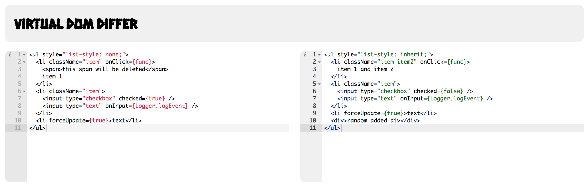

# virtual-dom

A lightweight virtual DOM implementation with visualizations.

### Completed

* Virtual DOM representation with the ability to make simple updates
* Managing props
* Handling events
* Step-handling Virtual DOM base class for visualizations
* Simple interactive UI for diffing JSX snippets

### In Progress

* Adding component life cycle to Virtual DOM
* Implementing O(ND) difference algorithm - http://www.xmailserver.org/diff2.pdf
